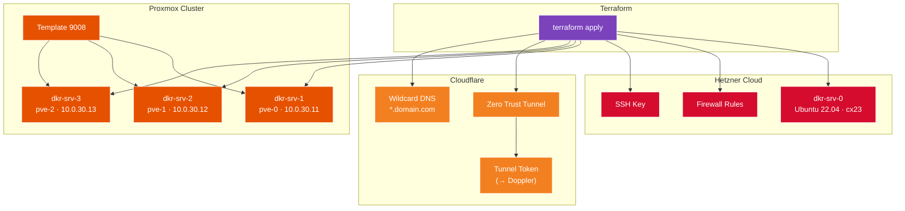

# Infrastructure Deployment (Terraform)

This directory contains the Terraform configuration for deploying the core infrastructure across Proxmox (on-premises) and Hetzner Cloud.

## Overview



## ⚠️ Important: Local State

The `terraform.tfstate` file is stored **locally** in this directory.

> **TODO:** Migrate to a remote backend (S3, Consul, or Terraform Cloud) for safe collaboration and CI/CD execution.

**Until migrated:**
- Do NOT run via GitHub Actions (no access to state file)
- Do NOT run from multiple machines simultaneously
- Back up `terraform.tfstate` regularly

## Prerequisites

- [Terraform](https://www.terraform.io/downloads) >= 1.0
- [Doppler CLI](https://docs.doppler.com/docs/install-cli)
- [Task](https://taskfile.dev/installation/)
- Proxmox VM template created (ID: 9008)
- API access to Proxmox, Hetzner Cloud, and Cloudflare

## Required Secrets (Doppler)

| Secret Name | Description | Used For |
|:---|:---|:---|
| `PROXMOX_VE_API_TOKEN` | Proxmox API token | VM creation |
| `HCLOUD_TOKEN` | Hetzner Cloud API token | Cloud server creation |
| `CLOUDFLARE_API_TOKEN` | Cloudflare API token | DNS, Tunnel management |
| `CLOUDFLARE_ACCOUNT_ID` | Cloudflare account ID | Zero Trust tunnel |
| `CLOUDFLARE_ZONE_ID` | Cloudflare zone ID | DNS records |
| `TF_VAR_SSH_PUBLIC_KEYS` | JSON list of SSH public keys | VM access |
| `ANSIBLE_SSH_USER` | Default VM username | Cloud-init user creation |
| `TF_VAR_proxmox_ssh_private_key_file` | Path to SSH private key | Proxmox provider access |
| `DOPPLER_TF_SRV_TOKEN` | Doppler service token | Doppler provider |

### Doppler Provider Configuration

This deployment uses the [Doppler Terraform Provider](https://registry.terraform.io/providers/DopplerHQ/doppler/latest) to automatically sync generated secrets (like `CLOUDFLARE_TUNNEL_TOKEN`) back to Doppler.

Required:
- `doppler_project`: Doppler project name
- `doppler_config`: Doppler config name (e.g., `dev`)

## Directory Structure

```
10_infra_deployment/
├── modules/
│   ├── proxmox-vm/          # Proxmox VM module
│   │   └── README.md        # Module documentation
│   └── hetzner-cloud/       # Hetzner Cloud module
│       └── README.md        # Module documentation
├── main_proxmox.tf          # Proxmox VM definitions
├── main_hcloud.tf           # Hetzner Cloud server
├── main_cf_tunnel.tf        # Cloudflare Tunnel & DNS
├── main_cf_access.tf        # Cloudflare Access policies
├── main_local.tf            # Local resources
├── providers.tf             # Provider configuration
├── variables.tf             # Input variables
├── outputs.tf               # Output values
├── generate_vars.sh         # Variable generation script
├── SETUP.md                 # This file
└── Taskfile.yml             # Task automation
```

## Resources Created

### Hetzner Cloud

| Resource | Name | Specification |
|:---|:---|:---|
| Server | `dkr-srv-0` | cx23, Ubuntu 22.04, Helsinki |
| Firewall | `dkr-srv-0-fw` | SSH, HTTP, HTTPS, Portainer |
| SSH Key | `id_macbook_fs` | Ed25519 key |

### Proxmox

| Resource | Name | Node | IP Address |
|:---|:---|:---|:---|
| VM | `dkr-srv-1` (ID: 3011) | pve-0 | 10.0.30.11 |
| VM | `dkr-srv-2` (ID: 3012) | pve-1 | 10.0.30.12 |
| VM | `dkr-srv-3` (ID: 3013) | pve-2 | 10.0.30.13 |

**VM Specifications:**
- Memory: 8 GB
- CPU: 4 cores × 2 sockets
- OS Disk: 32 GB (virtio0)
- Data Disk: 30 GB (scsi0) for LVM/GlusterFS
- Network: VLAN 30
- Template: 9008 (Debian 13)

### Cloudflare

| Resource | Description |
|:---|:---|
| Zero Trust Tunnel | Named after domain (e.g., `krapulax_dev`) |
| Tunnel Config | Wildcard ingress → `https://traefik:443` |
| DNS Record | `*` CNAME → tunnel endpoint |
| Doppler Secret | `CLOUDFLARE_TUNNEL_TOKEN` auto-synced |

## Usage

### Step 1: Configure Doppler

```bash
doppler setup
```

### Step 2: Initialize Terraform

```bash
task init
```

### Step 3: Plan Changes

```bash
task plan
```

Review the plan carefully. For migrations or updates, ensure it shows minimal changes.

### Step 4: Apply Changes

```bash
task apply
```

### Step 5: View Outputs

```bash
task output
```

## Firewall Rules (Hetzner)

| Port | Protocol | Purpose |
|:---|:---|:---|
| 22 | TCP | SSH access |
| 80 | TCP | HTTP (redirects to HTTPS) |
| 443 | TCP | HTTPS (Traefik) |
| 3000 | TCP | Dokploy UI (if used) |
| 9000 | TCP | Portainer HTTP |
| 9120 | TCP | Komodo (if used) |
| 9443 | TCP | Portainer HTTPS |
| 8080 | TCP | Test applications |

## VM ID Assignment

VM IDs are explicitly set to prevent Proxmox from assigning random IDs:

| VM | ID |
|:---|:---|
| dkr-srv-1 | 3011 |
| dkr-srv-2 | 3012 |
| dkr-srv-3 | 3013 |

This ensures consistency across recreations and updates.

## Terraform Modules

### Proxmox VM Module

Full documentation: [modules/proxmox-vm/README.md](modules/proxmox-vm/README.md)

Features:
- Clone from templates
- Multiple disk support
- VLAN configuration
- Cloud-init integration
- PCI/USB passthrough support

### Hetzner Cloud Module

Full documentation: [modules/hetzner-cloud/README.md](modules/hetzner-cloud/README.md)

Features:
- Server provisioning
- Firewall management
- SSH key management
- Snapshot creation

## Cloudflare Tunnel Configuration

The tunnel is configured with wildcard ingress:

```hcl
ingress = [
  {
    hostname = "*.yourdomain.com"
    service  = "https://traefik:443"
    origin_request = {
      no_tls_verify = true  # Trust Traefik's self-signed certs
    }
  },
  {
    service = "http_status:404"  # Catch-all
  }
]
```

## Troubleshooting

| Issue | Cause | Solution |
|:---|:---|:---|
| State lock error | Concurrent runs | Wait or force unlock: `terraform force-unlock <id>` |
| Proxmox auth error | Invalid token | Verify token format: `user@realm!tokenid=secret` |
| VM clone fails | Template not found | Ensure template 9008 exists on target node |
| Cloudflare API error | Invalid zone ID | Verify zone ID in Cloudflare dashboard |

### State Recovery

If state becomes corrupted:

```bash
# Backup current state
cp terraform.tfstate terraform.tfstate.backup

# Import existing resources
terraform import 'module.dkr_srv_1.proxmox_virtual_environment_vm.vm' pve-0/qemu/3011
```

## Notes

- **Explicit VM IDs:** Prevent ID reassignment during updates
- **generate_vars.sh:** Creates `.terraform.tfvars.json` from Doppler secrets
- **Doppler Integration:** Tunnel token auto-syncs to Doppler for app deployment

## Next Steps

After infrastructure deployment:

1. **Configure Servers:** `cd ../11_infra_configuration && task apply`
2. **Deploy Applications:** `cd ../20_app_deployment && task apply`
