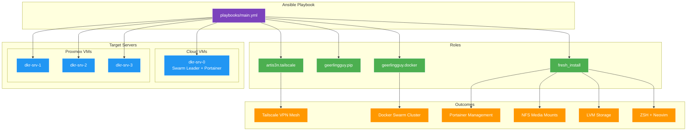

# Infrastructure Configuration (Ansible)

This directory contains Ansible playbooks and roles to configure the deployed infrastructure. It transforms bare VMs into fully configured Docker Swarm nodes.

## Overview



## Prerequisites

- [Ansible](https://docs.ansible.com/ansible/latest/installation_guide/) >= 2.12
- [Doppler CLI](https://docs.doppler.com/docs/install-cli)
- [Task](https://taskfile.dev/installation/)
- SSH access to all target servers
- Infrastructure deployed via `10_infra_deployment`

## Required Secrets (Doppler)

| Secret Name | Description | Example |
|:---|:---|:---|
| `ANSIBLE_SSH_USER` | Primary administrator username | `fs` |
| `ADMIN_PASSWORD` | Password for primary admin user | `securepassword` |
| `SECONDARY_PASSWORD` | Password for secondary user (`hacstac`) | `securepassword` |
| `TF_VAR_SSH_PUBLIC_KEYS` | JSON list of SSH public keys | `["ssh-rsa ..."]` |
| `TAILSCALE_AUTH_KEY` | Tailscale authentication key | `tskey-auth-...` |
| `PORTAINER_ADMIN_PASSWORD` | Initial Portainer admin password | `portaineradmin` |
| `DOMAIN` | Primary domain for applications | `example.com` |
| `DOMAIN_OPS` | Operations/management domain | `ops.example.com` |
| `DOMAIN_MEDIA` | Media services domain | `media.example.com` |
| `GITHUB_PERSONAL_ACCESS_TOKEN` | (Optional) For Neovim release checking | `ghp_...` |

### Getting a Tailscale Auth Key

1. Go to [Tailscale Admin Console](https://login.tailscale.com/admin/settings/keys)
2. Click **Generate auth key**
3. Enable **Reusable** (for multiple nodes)
4. Set expiry (or use ephemeral for one-time use)
5. Copy the key to Doppler as `TAILSCALE_AUTH_KEY`

## Directory Structure

```
11_infra_configuration/
├── inventory/
│   ├── hosts                    # Server inventory
│   └── group_vars/
│       └── all                  # Global variables
├── playbooks/
│   └── main.yml                 # Main playbook
├── roles/
│   ├── artis3n.tailscale/       # Tailscale VPN (Galaxy)
│   ├── geerlingguy.docker/      # Docker Engine (Galaxy)
│   ├── geerlingguy.pip/         # Python pip (Galaxy)
│   └── fresh_install/           # Custom server setup
│       ├── defaults/
│       ├── handlers/
│       ├── tasks/
│       │   ├── main.yml
│       │   ├── docker_setup.yml
│       │   ├── homelab_structure.yml
│       │   ├── locale_setup.yml
│       │   ├── lvm_management.yml
│       │   ├── neovim_installation.yml
│       │   ├── nfs_mount.yml
│       │   ├── package_installation.yml
│       │   ├── portainer_setup.yml
│       │   ├── python_setup.yml
│       │   ├── ssh_banner_setup.yml
│       │   ├── storage_setup.yml
│       │   ├── swarm_setup.yml
│       │   ├── system_update.yml
│       │   ├── user_management.yml
│       │   ├── webmin_setup.yml
│       │   └── zsh_setup.yml
│       └── templates/
├── ansible.cfg                  # Ansible configuration
├── run.sh                       # Alternative run script
├── SETUP.md                     # This file
└── Taskfile.yml                 # Task automation
```

## Inventory

### Server Groups

| Group | Members | Description |
|:---|:---|:---|
| `proxmox_vms` | dkr-srv-1, dkr-srv-2, dkr-srv-3 | On-premises Proxmox VMs |
| `cloud_vms` | dkr-srv-0 | Hetzner Cloud server |
| `vms` | All above | All managed VMs |
| `swarm_managers` | All VMs | Docker Swarm manager nodes |

### Host Variables

```ini
[proxmox_vms]
dkr-srv-1 ansible_host=10.0.30.11
dkr-srv-2 ansible_host=10.0.30.12
dkr-srv-3 ansible_host=10.0.30.13

[cloud_vms]
dkr-srv-0 ansible_host=157.180.84.140

[all:vars]
ansible_user=fs
ansible_ssh_private_key_file=~/.ssh/fs_home_rsa
```

## Configuration Details

### Docker Daemon Configuration

The Docker daemon is configured with:

```json
{
  "mtu": 1280,
  "hosts": [
    "tcp://<tailscale-ip>:2376",
    "unix:///var/run/docker.sock"
  ],
  "log-driver": "json-file",
  "log-opts": {
    "max-file": "3",
    "max-size": "10m"
  },
  "storage-driver": "overlay2",
  "live-restore": false,
  "userland-proxy": false,
  "default-address-pools": [
    {"base": "10.20.0.0/16", "size": 24}
  ]
}
```

### Storage Configuration

| Component | Description |
|:---|:---|
| **LVM Storage** | Secondary disk configured as LVM at `/data` |
| **NFS Mount** | Media share mounted at `/data/media` (Proxmox VMs only) |

**NFS Configuration:**
- Server: `10.0.40.2`
- Share: `/media`
- Mount Point: `/data/media`
- Applied to: `proxmox_vms` group only

### Docker Swarm Topology

| Node | Role | Labels |
|:---|:---|:---|
| dkr-srv-0 | Manager | `cloud=true`, `leader=true` |
| dkr-srv-1 | Manager | `proxmox=true` |
| dkr-srv-2 | Manager | `proxmox=true` |
| dkr-srv-3 | Manager | `proxmox=true` |

### Portainer Deployment

Portainer is deployed only on `dkr-srv-0` (cloud leader):

- **URL:** `https://<public-ip>:9443` or `https://portainer.<domain>`
- **Admin Password:** Set via `PORTAINER_ADMIN_PASSWORD`
- **API Token:** Generated and displayed at playbook completion

## Usage

### Step 1: Configure Doppler

```bash
doppler setup
```

### Step 2: Install Dependencies

Install required Ansible collections and roles:

```bash
task init
```

This installs:
- `community.general`
- `ansible.posix`
- `community.docker`
- `geerlingguy.docker`
- `geerlingguy.pip`
- `artis3n.tailscale`

### Step 3: Plan (Dry Run)

Preview changes without applying:

```bash
task plan
```

### Step 4: Apply Configuration

```bash
task apply
```

## What Gets Configured

### Per-Server Configuration

| Task | Description | Tags |
|:---|:---|:---|
| Locale Setup | Set system locale to en_US.UTF-8 | `locale` |
| User Management | Create admin and secondary users | `users` |
| System Updates | Update and upgrade packages | `system`, `updates` |
| Package Installation | Install common utilities | `packages` |
| Storage Setup | Configure LVM on secondary disk | `storage`, `lvm` |
| NFS Mount | Mount media share (Proxmox only) | `storage`, `nfs` |
| Python Setup | Install Python packages | `python` |
| Docker Setup | Additional Docker configuration | `docker` |
| Swarm Setup | Initialize/join Docker Swarm | `swarm` |
| ZSH Setup | Install Oh-My-Zsh | `zsh` |
| Neovim | Install latest Neovim | `neovim` |
| Webmin | Install Webmin/Usermin | `webmin` |
| SSH Banner | Configure SSH banner | `ssh`, `banner` |

### Cloud Leader Only

| Task | Description |
|:---|:---|
| Portainer Setup | Deploy Portainer with API token |
| Swarm Init | Initialize Swarm cluster |

## Using Tags

Run specific parts of the playbook:

```bash
# Only configure Docker
doppler run -- ansible-playbook -i inventory/hosts playbooks/main.yml --tags docker

# Skip Webmin installation
doppler run -- ansible-playbook -i inventory/hosts playbooks/main.yml --skip-tags webmin
```

## Post-Configuration

After playbook completion, you'll see:

```
==================================================
🚀 PORTAINER DEPLOYMENT COMPLETE

🌐 Access URLs:
   • Public IP:    https://157.180.84.140:9443
   • Tailscale IP: https://100.x.x.x:9443
   • Domain:       https://portainer.example.com

🔑 API Token (terraform):
   ptr_xxxxxxxxxxxxxxxxxxxxxxxxxxxx

⚠️ Note: Store this token securely. It will not be shown again.
==================================================
```

**Save the API token in Doppler as `PORTAINER_ACCESS_TOKEN`.**

## Troubleshooting

| Issue | Cause | Solution |
|:---|:---|:---|
| Tailscale connection timeout | Auth key expired | Generate new key in Tailscale admin |
| SSH permission denied | Key not authorized | Verify public key in cloud-init |
| NFS mount fails | Network unreachable | Check VLAN routing from VLAN 30 to 40 |
| Swarm join fails | Token expired | Re-run swarm setup or manually get token |
| Portainer not accessible | Firewall blocking | Check Hetzner firewall for port 9443 |

### Manual Swarm Management

```bash
# View cluster status
docker node ls

# Get join token for managers
docker swarm join-token manager

# Get join token for workers
docker swarm join-token worker

# Remove a node
docker node rm <node-id>
```

### Verify Tailscale Mesh

```bash
# On any node
tailscale status

# Check connectivity
tailscale ping dkr-srv-1
```

## Notes

- **Tailscale SSH:** Enabled via `--ssh` flag for emergency access
- **Docker MTU:** Set to 1280 for Tailscale compatibility
- **LVM:** Automatically detects largest additional disk
- **Homelab Structure:** Creates `/data/homelab/` directory structure

## Next Steps

After configuration:

1. **Save Portainer Token:** Add `PORTAINER_ACCESS_TOKEN` to Doppler
2. **Deploy Applications:** `cd ../20_app_deployment && task apply`
3. **Verify Swarm:** `ssh fs@dkr-srv-0 'docker node ls'`
