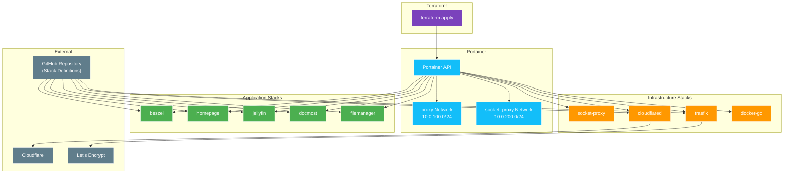

# Application Deployment (Terraform + Portainer)

This directory contains Terraform configuration to deploy Docker stacks via Portainer's GitOps functionality. Stacks are defined in the `docker/` directory and automatically synced from this repository.

## Overview



## Prerequisites

- [Terraform](https://www.terraform.io/downloads) >= 1.0
- [Doppler CLI](https://docs.doppler.com/docs/install-cli)
- [Task](https://taskfile.dev/installation/)
- Portainer deployed and accessible (from `11_infra_configuration`)
- Portainer API token (from `11_infra_configuration` output)

## Required Secrets (Doppler)

### Core Secrets

| Secret Name | Description | Example |
|:---|:---|:---|
| `PORTAINER_ACCESS_TOKEN` | Portainer API token | `ptr_xxxxxxxxxxxx` |
| `DOMAIN` | Primary domain for applications | `example.com` |
| `TZ` | Timezone | `Europe/London` |

### Traefik Secrets

| Secret Name | Description |
|:---|:---|
| `CLOUDFLARE_API_TOKEN` | Cloudflare API token (DNS-01 challenge) |
| `ACME_EMAIL` | Email for Let's Encrypt registration |

### Cloudflare Tunnel Secrets

| Secret Name | Description |
|:---|:---|
| `CLOUDFLARE_TUNNEL_TOKEN` | Cloudflare tunnel token (auto-generated by infra deployment) |

### Beszel Secrets

| Secret Name | Description |
|:---|:---|
| `BESZEL_AGENT_KEY` | Beszel agent public key (from Hub) |
| `BESZEL_AGENT_TOKEN` | Beszel agent token |

### Homepage Secrets

| Secret Name | Description |
|:---|:---|
| `PORTAINER_ACCESS_TOKEN` | Portainer API token (reused) |
| `JELLYFIN_API_KEY` | Jellyfin API key for widget |

### Docmost Secrets

| Secret Name | Description |
|:---|:---|
| `DOCMOST_APP_SECRET` | Application secret (min 32 chars) |
| `DOCMOST_POSTGRES_PASSWORD` | PostgreSQL password |

### Filemanager Secrets

| Secret Name | Description |
|:---|:---|
| `FILEBROWSER_ADMIN_PASSWORD` | Filebrowser admin password |
| `PERSISTENT_TOKENS_KEY` | Filerise token encryption key |

### Arr Stack Secrets (Optional - Currently Disabled)

| Secret Name | Description |
|:---|:---|
| `AUTOBRR_SESSION_SECRET` | Autobrr session secret |
| `AUTOBRR_POSTGRES_PASSWORD` | Autobrr PostgreSQL password |
| `RADARR_API_KEY` | Radarr API key |
| `SONARR_API_KEY` | Sonarr API key |
| `BAZARR_API_KEY` | Bazarr API key |
| `SABNZBD_API_KEY` | SABnzbd API key |

## Directory Structure

```
20_app_deployment/
├── terraform/
│   ├── main.tf              # Stack definitions
│   ├── providers.tf         # Provider configuration
│   ├── variables.tf         # Input variables
│   ├── terraform.tfstate    # Local state (⚠️)
│   └── .terraform/          # Provider cache
├── SETUP.md                 # This file
└── Taskfile.yml             # Task automation
```

## Deployed Resources

### Networks

| Resource | Type | Subnet | Purpose |
|:---|:---|:---|:---|
| `proxy` | Overlay (Swarm) | `10.0.100.0/24` | Traefik ingress network |
| `socket_proxy` | Overlay (Swarm) | `10.0.200.0/24` | Docker socket proxy network |

### Infrastructure Stacks

| Stack | Source | Purpose | Placement |
|:---|:---|:---|:---|
| `socket-proxy` | `docker/socket-proxy/socket-proxy-stack.yml` | Docker API proxy | Cloud leader |
| `traefik` | `docker/traefik/traefik-stack.yml` | Ingress, SSL | Cloud leader |
| `whoami` | `docker/traefik/whoami-stack.yml` | Load balancer test | Any manager |
| `cloudflared` | `docker/cloudflared/cloudflared-stack.yml` | Tunnel connector | Managers |
| `docker-gc` | `docker/docker-gc/docker-gc-stack.yml` | Image cleanup | All nodes |

### Application Stacks

| Stack | Source | Purpose | Placement |
|:---|:---|:---|:---|
| `beszel` | `docker/beszel/beszel-stack.yml` | Monitoring | Hub: leader, Agent: all |
| `homepage` | `docker/homepage/homepage-stack.yml` | Dashboard | Cloud leader |
| `jellyfin` | `docker/jellyfin/jellyfin-stack.yml` | Media server | Proxmox nodes |
| `docmost` | `docker/docmost/docmost-stack.yml` | Documentation | Proxmox nodes |
| `filemanager` | `docker/filemanager/filemanager-stack.yml` | File browser | Proxmox nodes |

### Disabled Stacks (Ready to Enable)

| Stack | Source | Purpose | Enable By |
|:---|:---|:---|:---|
| `arr` | `docker/arr/arr-stack.yml` | Media automation | Uncomment in main.tf |
| `glance` | `docker/glance/glance-stack.yml` | Dashboard | Add to main.tf |

## Configuration

### Terraform Variables

| Variable | Default | Description |
|:---|:---|:---|
| `portainer_url` | `https://157.180.84.140:9443` | Portainer instance URL |
| `endpoint_id` | `1` | Portainer environment ID |
| `repository_url` | This repo's URL | Git repository for stacks |
| `repository_branch` | `refs/heads/main` | Git branch reference |

### Common Stack Environment Variables

All stacks receive these base variables:

| Variable | Value | Description |
|:---|:---|:---|
| `TZ` | `Europe/London` | Timezone |
| `PUID` | `1000` | User ID for file ownership |
| `PGID` | `1000` | Group ID for file ownership |
| `DOMAIN` | From Doppler | Base domain |

## Usage

### Step 1: Configure Doppler

```bash
doppler setup
```

### Step 2: Initialize Terraform

```bash
task init
```

### Step 3: Plan Changes

```bash
task plan
```

### Step 4: Apply Changes

```bash
task apply
```

### Step 5: Verify Deployment

```bash
# Check stack status in Portainer UI
# Or via Docker CLI on the Swarm leader:
ssh fs@dkr-srv-0 'docker stack ls'
```

## Adding New Stacks

### Step 1: Create Stack Definition

Create a new directory in `docker/`:

```
docker/myapp/
├── myapp-stack.yml    # Docker Compose/Swarm file
└── setup.md           # Setup documentation
```

### Step 2: Add Terraform Resource

Add to `terraform/main.tf`:

```hcl
resource "portainer_stack" "myapp" {
  endpoint_id               = var.endpoint_id
  name                      = "myapp"
  method                    = "repository"
  deployment_type           = "swarm"
  repository_url            = var.repository_url
  repository_reference_name = var.repository_branch
  file_path_in_repository   = "docker/myapp/myapp-stack.yml"
  force_update              = true
  pull_image                = true
  prune                     = true
  update_interval           = "5m"
  stack_webhook             = true

  env {
    name  = "DOMAIN"
    value = local.domain
  }

  env {
    name  = "TZ"
    value = local.tz
  }

  env {
    name  = "PUID"
    value = local.puid
  }

  env {
    name  = "PGID"
    value = local.pgid
  }

  depends_on = [portainer_stack.traefik]
}
```

### Step 3: Add Variables (if needed)

Add new variables to `terraform/variables.tf` and update `Taskfile.yml`.

### Step 4: Deploy

```bash
task apply
```

## GitOps Workflow

Stacks are configured for GitOps:

1. **Push changes** to `docker/*/` in this repository
2. **Portainer polls** the repository (every 5 minutes)
3. **Stack redeploys** automatically with new configuration

To trigger a manual redeploy:
- Use Portainer UI: Stack → **Pull and redeploy**
- Or re-run: `task apply`

## Stack Details

### Socket Proxy

Provides secure Docker API access for Traefik and other services.

- **Documentation:** [docker/socket-proxy/setup.md](../docker/socket-proxy/setup.md)
- **Network:** Creates `socket_proxy` overlay network

### Traefik

Ingress controller with automatic SSL via Let's Encrypt.

- **Dashboard:** `https://traefik.<domain>`
- **Documentation:** [docker/traefik/setup.md](../docker/traefik/setup.md)

### Cloudflared

Cloudflare Tunnel connector for zero-trust access.

- **Mode:** 2 replicas on managers
- **Documentation:** [docker/cloudflared/setup.md](../docker/cloudflared/setup.md)

### Docker GC

Automated daily cleanup of unused Docker resources.

- **Mode:** Global (all nodes)
- **Schedule:** 23:00 daily
- **Documentation:** [docker/docker-gc/setup.md](../docker/docker-gc/setup.md)

### Beszel

Server monitoring with Hub-Agent architecture.

- **Hub:** `https://beszel.<domain>`
- **Agent:** Global service on port 45876
- **Documentation:** [docker/beszel/setup.md](../docker/beszel/setup.md)

### Homepage

Modern application dashboard.

- **Access:** `https://home.<domain>`
- **Documentation:** [docker/homepage/setup.md](../docker/homepage/setup.md)

### Jellyfin

Media server for movies, TV shows, and music.

- **Access:** `https://jellyfin.<domain>`
- **Documentation:** [docker/jellyfin/setup.md](../docker/jellyfin/setup.md)

### Docmost

Documentation and knowledge base.

- **Access:** `https://doc.<domain>`
- **Documentation:** [docker/docmost/setup.md](../docker/docmost/setup.md)

### Filemanager

Web-based file management (Filebrowser + Filerise).

- **Filebrowser:** `https://file.<domain>`
- **Filerise:** `https://rise.<domain>`
- **Documentation:** [docker/filemanager/setup.md](../docker/filemanager/setup.md)

## Troubleshooting

| Issue | Cause | Solution |
|:---|:---|:---|
| Stack fails to create | Invalid stack YAML | Validate YAML syntax |
| "401 Unauthorized" | Invalid/expired token | Regenerate Portainer token |
| Stack stuck "pending" | Git clone failing | Check repository access |
| Services not routing | Traefik not running | Check traefik stack first |
| SSL certificate errors | DNS-01 challenge failed | Verify Cloudflare API token |
| Volume mount errors | Directory doesn't exist | Create directories on hosts |

### Check Stack Logs

```bash
# SSH to Swarm leader
ssh fs@dkr-srv-0

# List stacks
docker stack ls

# List services in a stack
docker stack services traefik

# Check service logs
docker service logs traefik_traefik
docker service logs cloudflared_cloudflared
docker service logs beszel_beszel
docker service logs homepage_homepage
docker service logs jellyfin_jellyfin
```

### Redeploy a Stack

Via Portainer:
1. Go to **Stacks** → Select stack
2. Click **Pull and redeploy**

Via Terraform:
```bash
# Taint the resource to force recreation
cd terraform
terraform taint 'portainer_stack.traefik'
task apply
```

## Destroying Resources

To remove all stacks:

```bash
task destroy
```

⚠️ This removes all deployed stacks but preserves Docker volumes.

## Notes

- **Local State:** Terraform state is stored locally in `terraform/terraform.tfstate`
- **Portainer Provider:** Uses [portainer/portainer](https://registry.terraform.io/providers/portainer/portainer/latest)
- **GitOps Source:** Stacks pull from `refs/heads/main` branch
- **Update Interval:** Portainer checks for updates every 5 minutes

## Service Access Summary

| Service | URL | Description |
|:---|:---|:---|
| Traefik | `https://traefik.<domain>` | Ingress dashboard |
| Homepage | `https://home.<domain>` | Application dashboard |
| Beszel | `https://beszel.<domain>` | Server monitoring |
| Jellyfin | `https://jellyfin.<domain>` | Media server |
| Docmost | `https://doc.<domain>` | Documentation |
| Filebrowser | `https://file.<domain>` | File manager |
| Filerise | `https://rise.<domain>` | Photo/file manager |
| Whoami | `https://whoami.<domain>` | Load balancer test |

## Next Steps

After application deployment:

1. **Access Traefik:** `https://traefik.<domain>`
2. **Access Portainer:** `https://<public-ip>:9443` or via tunnel
3. **Initialize Beszel:** See [docker/beszel/setup.md](../docker/beszel/setup.md)
4. **Configure Homepage:** Edit configs in `docker/homepage/config/`
5. **Setup Jellyfin:** Complete initial wizard, generate API key
6. **Deploy more stacks:** Add to `docker/` and `terraform/main.tf`
