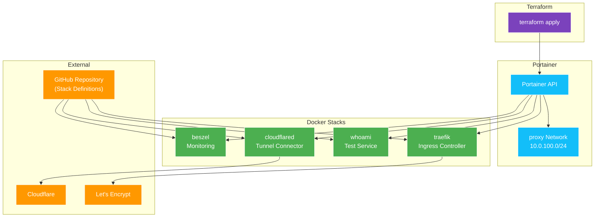

# Application Deployment (Terraform + Portainer)

This directory contains Terraform configuration to deploy Docker stacks via Portainer's GitOps functionality. Stacks are defined in the `docker/` directory and automatically synced from this repository.

## Overview



## Prerequisites

- [Terraform](https://www.terraform.io/downloads) >= 1.0
- [Doppler CLI](https://docs.doppler.com/docs/install-cli)
- [Task](https://taskfile.dev/installation/)
- Portainer deployed and accessible (from `11_infra_configuration`)
- Portainer API token (from `11_infra_configuration` output)

## Required Secrets (Doppler)

| Secret Name | Description | Example |
|:---|:---|:---|
| `PORTAINER_ACCESS_TOKEN` | Portainer API token | `ptr_xxxxxxxxxxxx` |
| `CLOUDFLARE_API_TOKEN` | Cloudflare API token (DNS-01 challenge) | `abc123...` |
| `CLOUDFLARE_TUNNEL_TOKEN` | Cloudflare tunnel token (auto-generated) | `eyJ...` |
| `DOMAIN` | Primary domain for applications | `example.com` |
| `ACME_EMAIL` | Email for Let's Encrypt registration | `admin@example.com` |
| `BESZEL_AGENT_KEY` | Beszel agent public key (from Hub) | `ssh-ed25519 AAAA...` |

### Getting the Portainer Access Token

The token is generated during `11_infra_configuration`:

1. Check the Ansible playbook output for the token
2. Or manually create via Portainer UI:
   - Go to **Settings** → **Users** → Your user
   - Click **Add access token**
   - Copy and save to Doppler

### Getting the Beszel Agent Key

See [docker/beszel/setup.md](../docker/beszel/setup.md) for the Hub initialization process.

## Directory Structure

```
20_app_deployment/
├── terraform/
│   ├── main.tf              # Stack definitions
│   ├── providers.tf         # Provider configuration
│   ├── variables.tf         # Input variables
│   ├── terraform.tfstate    # Local state (⚠️)
│   └── .terraform/          # Provider cache
├── SETUP.md                 # This file
└── Taskfile.yml             # Task automation
```

## Deployed Resources

### Network

| Resource | Type | Subnet | Purpose |
|:---|:---|:---|:---|
| `proxy` | Overlay (Swarm) | 10.0.100.0/24 | Traefik ingress network |

### Stacks

| Stack | Source | Purpose | Dependencies |
|:---|:---|:---|:---|
| `traefik` | `docker/traefik/traefik-stack.yml` | Ingress, SSL | Network |
| `whoami` | `docker/traefik/whoami-stack.yml` | Load balancer test | Traefik |
| `cloudflared` | `docker/cloudflared/cloudflared-stack.yml` | Tunnel connector | Traefik |
| `beszel` | `docker/beszel/beszel-stack.yml` | Monitoring | Traefik |

## Configuration

### Terraform Variables

| Variable | Default | Description |
|:---|:---|:---|
| `portainer_url` | `https://157.180.84.140:9443` | Portainer instance URL |
| `endpoint_id` | `1` | Portainer environment ID |
| `repository_url` | This repo's URL | Git repository for stacks |
| `repository_branch` | `refs/heads/main` | Git branch reference |

### Stack Environment Variables

Each stack receives environment variables from Doppler:

**traefik:**
- `CLOUDFLARE_API_TOKEN` - DNS-01 challenge auth
- `ACME_EMAIL` - Let's Encrypt registration
- `DOMAIN` - Base domain for routing

**whoami:**
- `DOMAIN` - Base domain for routing

**cloudflared:**
- `CLOUDFLARE_TUNNEL_TOKEN` - Tunnel authentication

**beszel:**
- `DOMAIN` - Base domain for routing
- `BESZEL_AGENT_KEY` - Agent authentication

## Usage

### Step 1: Configure Doppler

```bash
doppler setup
```

### Step 2: Initialize Terraform

```bash
task init
```

### Step 3: Plan Changes

```bash
task plan
```

### Step 4: Apply Changes

```bash
task apply
```

### Step 5: Verify Deployment

```bash
# Check stack status in Portainer UI
# Or via Docker CLI on the Swarm leader:
ssh fs@dkr-srv-0 'docker stack ls'
```

## Adding New Stacks

### Step 1: Create Stack Definition

Create a new directory in `docker/`:

```
docker/myapp/
├── myapp-stack.yml    # Docker Compose/Swarm file
└── setup.md           # Setup documentation
```

### Step 2: Add Terraform Resource

Add to `terraform/main.tf`:

```hcl
resource "portainer_stack" "myapp" {
  endpoint_id               = var.endpoint_id
  name                      = "myapp"
  method                    = "repository"
  deployment_type           = "swarm"
  repository_url            = var.repository_url
  repository_reference_name = var.repository_branch
  file_path_in_repository   = "docker/myapp/myapp-stack.yml"

  env {
    name  = "DOMAIN"
    value = var.apps_domain
  }

  # Add more env vars as needed

  depends_on = [portainer_stack.traefik]
}
```

### Step 3: Add Variables (if needed)

Add new variables to `terraform/variables.tf` and update `Taskfile.yml`.

### Step 4: Deploy

```bash
task apply
```

## GitOps Workflow

Stacks are configured for GitOps:

1. **Push changes** to `docker/*/` in this repository
2. **Portainer polls** the repository for changes
3. **Stack redeploys** automatically with new configuration

To trigger a manual redeploy:
- Use Portainer UI: Stack → **Pull and redeploy**
- Or re-run: `task apply`

## Stack Details

### Traefik

**Services Exposed:**
- Dashboard: `https://traefik.<domain>`

**Key Configuration:**
- DNS-01 challenge via Cloudflare
- Automatic HTTP → HTTPS redirect
- Swarm mode provider
- Runs on cloud leader (`node.labels.leader == true`)

See: [docker/traefik/setup.md](../docker/traefik/setup.md)

### Whoami

**Purpose:** Test load balancing and routing

**Access:** `https://whoami.<domain>`

Refresh the page to see different container hostnames.

### Cloudflared

**Purpose:** Connect Cloudflare Tunnel to Traefik

**Mode:** Global service (runs on all nodes for redundancy)

See: [docker/cloudflared/setup.md](../docker/cloudflared/setup.md)

### Beszel

**Components:**
- Hub: Web UI at `https://beszel.<domain>`
- Agent: Global service on all nodes

See: [docker/beszel/setup.md](../docker/beszel/setup.md)

## Troubleshooting

| Issue | Cause | Solution |
|:---|:---|:---|
| Stack fails to create | Invalid stack YAML | Validate YAML syntax |
| "401 Unauthorized" | Invalid/expired token | Regenerate Portainer token |
| Stack stuck "pending" | Git clone failing | Check repository access |
| Services not routing | Traefik not running | Check traefik stack first |
| SSL certificate errors | DNS-01 challenge failed | Verify Cloudflare API token |

### Check Stack Logs

```bash
# SSH to Swarm leader
ssh fs@dkr-srv-0

# List stacks
docker stack ls

# List services in a stack
docker stack services traefik

# Check service logs
docker service logs traefik_traefik
docker service logs cloudflared_cloudflared
docker service logs beszel_hub
```

### Redeploy a Stack

Via Portainer:
1. Go to **Stacks** → Select stack
2. Click **Pull and redeploy**

Via Terraform:
```bash
# Taint the resource to force recreation
cd terraform
terraform taint 'portainer_stack.traefik'
task apply
```

## Destroying Resources

To remove all stacks:

```bash
task destroy
```

⚠️ This removes all deployed stacks but preserves Docker volumes.

## Notes

- **Local State:** Terraform state is stored locally in `terraform/terraform.tfstate`
- **Portainer Provider:** Uses [portainer/portainer](https://registry.terraform.io/providers/portainer/portainer/latest)
- **GitOps Source:** Stacks pull from `refs/heads/main` branch

## Next Steps

After application deployment:

1. **Access Traefik:** `https://traefik.<domain>`
2. **Access Portainer:** `https://<public-ip>:9443` or via tunnel
3. **Configure Beszel:** See [docker/beszel/setup.md](../docker/beszel/setup.md)
4. **Deploy more stacks:** Add to `docker/` and `terraform/main.tf`
