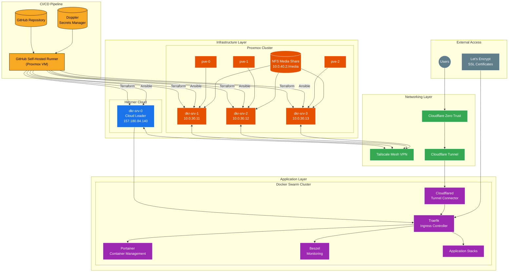
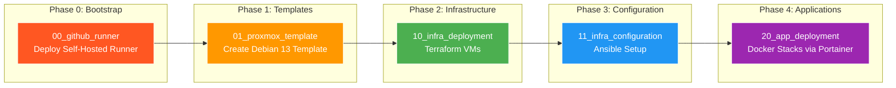

# Project DockerStack MK2

A comprehensive Infrastructure as Code (IaC) and configuration management solution for a hybrid homelab environment spanning Proxmox (on-premises) and Hetzner Cloud.

## Architecture Overview



## Deployment Workflow



## Prerequisites

Before starting, ensure you have the following tools installed:

| Tool | Purpose | Installation |
|------|---------|--------------|
| [Doppler CLI](https://docs.doppler.com/docs/install-cli) | Secrets management | `brew install dopplerhq/cli/doppler` |
| [Terraform](https://www.terraform.io/downloads) | Infrastructure provisioning | `brew install terraform` |
| [Ansible](https://docs.ansible.com/ansible/latest/installation_guide/) | Configuration management | `brew install ansible` |
| [Task](https://taskfile.dev/installation/) | Task runner | `brew install go-task` |
| [Docker](https://docs.docker.com/get-docker/) | Container runtime | `brew install --cask docker` |

## Quick Start

### 1. Clone and Configure Doppler

```bash
git clone https://github.com/fabricesemti80/project-dockerstack-mk2.git
cd project-dockerstack-mk2
doppler setup
```

### 2. Deploy GitHub Runner (Bootstrap)

```bash
cd 00_github_runner
task init && task apply && task provision
```

### 3. Create VM Template

```bash
cd 01_proxmox_template
task create_template
```

### 4. Deploy Infrastructure

```bash
cd 10_infra_deployment
task init && task apply
```

### 5. Configure Servers

```bash
cd 11_infra_configuration
task init && task apply
```

### 6. Deploy Applications

```bash
cd 20_app_deployment
task init && task apply
```

## Directory Structure

```
project-dockerstack-mk2/
├── 00_github_runner/        # Bootstrap: Self-hosted GitHub Actions runner
│   ├── ansible/             # Ansible playbook for runner configuration
│   ├── terraform/           # Terraform for runner VM creation
│   ├── SETUP.md             # Setup instructions
│   └── Taskfile.yml         # Task automation
│
├── 01_proxmox_template/     # Debian 13 cloud-init template creation
│   ├── ansible/             # Ansible playbook for template creation
│   ├── SETUP.md             # Setup instructions
│   └── Taskfile.yml         # Task automation
│
├── 10_infra_deployment/     # Core infrastructure (Terraform)
│   ├── modules/
│   │   ├── proxmox-vm/      # Proxmox VM module
│   │   └── hetzner-cloud/   # Hetzner Cloud server module
│   ├── main_proxmox.tf      # Proxmox VM definitions
│   ├── main_hcloud.tf       # Hetzner Cloud definitions
│   ├── main_cf_tunnel.tf    # Cloudflare Tunnel setup
│   ├── main_cf_access.tf    # Cloudflare Access policies
│   ├── SETUP.md             # Setup instructions
│   └── Taskfile.yml         # Task automation
│
├── 11_infra_configuration/  # Server configuration (Ansible)
│   ├── inventory/           # Ansible inventory
│   │   ├── hosts            # Server definitions
│   │   └── group_vars/      # Group variables
│   ├── playbooks/           # Ansible playbooks
│   ├── roles/               # Ansible roles
│   │   ├── fresh_install/   # Custom server setup role
│   │   ├── geerlingguy.docker/
│   │   ├── geerlingguy.pip/
│   │   └── artis3n.tailscale/
│   ├── SETUP.md             # Setup instructions
│   └── Taskfile.yml         # Task automation
│
├── 20_app_deployment/       # Application deployment (Terraform + Portainer)
│   ├── terraform/           # Portainer GitOps stacks
│   ├── SETUP.md             # Setup instructions
│   └── Taskfile.yml         # Task automation
│
├── docker/                  # Docker stack definitions
│   ├── traefik/             # Traefik ingress controller
│   ├── cloudflared/         # Cloudflare tunnel connector
│   └── beszel/              # Server monitoring
│
└── .github/
    └── workflows/           # GitHub Actions workflows
        └── proxmox-template.yml
```

## Components

### 1. GitHub Runner Setup (`00_github_runner/`)

Provisions a dedicated VM on Proxmox to host a GitHub self-hosted runner. This enables GitHub Actions to execute tasks directly on the local network.

- **[Setup Guide](00_github_runner/SETUP.md)**
- **Tools:** Terraform + Ansible
- **Installs:** Ansible, Task, Doppler CLI, Docker

### 2. VM Templates (`01_proxmox_template/`)

Automated Debian 13 (Trixie) cloud-init template generation on Proxmox.

- **[Setup Guide](01_proxmox_template/SETUP.md)**
- **Template ID:** `9008`
- **Features:** QEMU Guest Agent pre-installed via libguestfs

### 3. Infrastructure Deployment (`10_infra_deployment/`)

Core infrastructure provisioning using Terraform:

| Resource | Provider | Description |
|----------|----------|-------------|
| `dkr-srv-0` | Hetzner Cloud | Cloud leader node (Ubuntu 22.04, cx23) |
| `dkr-srv-1` | Proxmox | Docker node on pve-0 |
| `dkr-srv-2` | Proxmox | Docker node on pve-1 |
| `dkr-srv-3` | Proxmox | Docker node on pve-2 |
| Cloudflare Tunnel | Cloudflare | Zero Trust tunnel for secure access |
| DNS Records | Cloudflare | Wildcard CNAME for tunnel ingress |

- **[Setup Guide](10_infra_deployment/SETUP.md)**
- **⚠️ Note:** Currently uses local Terraform state

### 4. Infrastructure Configuration (`11_infra_configuration/`)

Server configuration using Ansible roles:

| Role/Task | Description |
|-----------|-------------|
| `artis3n.tailscale` | Mesh VPN for secure inter-node communication |
| `geerlingguy.docker` | Docker Engine with custom daemon configuration |
| `geerlingguy.pip` | Python package management |
| `fresh_install` | Custom role for complete server setup |

**fresh_install role includes:**
- User management (admin + secondary user)
- System updates and package installation
- Storage setup (LVM on secondary disk)
- NFS media mount (Proxmox VMs only)
- Docker Swarm cluster formation
- Portainer deployment (cloud leader only)
- ZSH with Oh-My-Zsh
- Neovim installation
- Webmin/Usermin setup
- SSH banner configuration

- **[Setup Guide](11_infra_configuration/SETUP.md)**

### 5. Application Deployment (`20_app_deployment/`)

Docker stack deployment via Terraform and Portainer GitOps:

| Stack | Description |
|-------|-------------|
| `traefik` | Ingress controller with Let's Encrypt SSL |
| `whoami` | Test service for load balancing verification |
| `cloudflared` | Cloudflare tunnel connector |
| `beszel` | Lightweight server monitoring |

- **[Setup Guide](20_app_deployment/SETUP.md)**

### 6. Docker Stacks (`docker/`)

Docker Compose/Swarm stack definitions:

| Stack | Description | Setup Guide |
|-------|-------------|-------------|
| [Traefik](docker/traefik/) | Reverse proxy with automatic SSL | [Setup](docker/traefik/setup.md) |
| [Cloudflared](docker/cloudflared/) | Cloudflare tunnel connector | [Setup](docker/cloudflared/setup.md) |
| [Beszel](docker/beszel/) | Server monitoring with Hub-Agent architecture | [Setup](docker/beszel/setup.md) |

## Secrets Management (Doppler)

All secrets are managed via [Doppler](https://www.doppler.com/). The following table lists all required secrets:

### Global Secrets

| Secret | Description | Used In |
|--------|-------------|---------|
| `ANSIBLE_SSH_USER` | Primary admin username (e.g., `fs`) | All components |
| `ANSIBLE_SSH_PRIVATE_KEY` | Private SSH key for Ansible | All components |
| `TF_VAR_SSH_PUBLIC_KEYS` | JSON list of SSH public keys | All components |
| `ADMIN_PASSWORD` | Password for primary admin user | Templates, Configuration |
| `SECONDARY_PASSWORD` | Password for secondary user (`hacstac`) | Configuration |

### Infrastructure Secrets

| Secret | Description | Used In |
|--------|-------------|---------|
| `PROXMOX_VE_API_TOKEN` | Proxmox API token | Runner, Infra Deployment |
| `PROXMOX_HOST` | Proxmox host IP/hostname | Templates |
| `HCLOUD_TOKEN` | Hetzner Cloud API token | Infra Deployment |
| `CLOUDFLARE_API_TOKEN` | Cloudflare API token | Infra Deployment, Apps |
| `CLOUDFLARE_ACCOUNT_ID` | Cloudflare account ID | Infra Deployment |
| `CLOUDFLARE_ZONE_ID` | Cloudflare zone ID | Infra Deployment |
| `CLOUDFLARE_TUNNEL_TOKEN` | Tunnel token (auto-generated) | Apps |

### Application Secrets

| Secret | Description | Used In |
|--------|-------------|---------|
| `DOMAIN` | Primary domain for applications | Configuration, Apps |
| `DOMAIN_OPS` | Operations/management domain | Configuration |
| `DOMAIN_MEDIA` | Media services domain | Configuration |
| `ACME_EMAIL` | Let's Encrypt registration email | Apps |
| `PORTAINER_ADMIN_PASSWORD` | Portainer admin password | Configuration |
| `PORTAINER_ACCESS_TOKEN` | Portainer API token | Apps |
| `TAILSCALE_AUTH_KEY` | Tailscale authentication key | Configuration |
| `BESZEL_AGENT_KEY` | Beszel agent public key | Apps |

### GitHub Actions Secrets

| Secret | Description |
|--------|-------------|
| `DOPPLER_TOKEN` | Doppler service token for CI/CD |
| `RUNNER_TOKEN` | GitHub runner registration token |
| `REPO_URL` | GitHub repository/organization URL |

## Network Architecture

### VLAN Configuration

| VLAN | Subnet | Purpose |
|------|--------|---------|
| 30 | 10.0.30.0/24 | Docker/Container hosts |
| 40 | 10.0.40.0/24 | Infrastructure services |

### Docker Networking

| Network | Type | Subnet | Purpose |
|---------|------|--------|---------|
| `proxy` | Overlay | 10.0.100.0/24 | Traefik ingress |

### DNS Configuration

All services are accessible via `*.yourdomain.com` through Cloudflare Tunnel:
- Traffic flows: User → Cloudflare → Tunnel → Traefik → Service
- SSL termination at Traefik with Let's Encrypt certificates

## Server Specifications

### Hetzner Cloud (dkr-srv-0)

| Spec | Value |
|------|-------|
| Type | cx23 |
| Location | Helsinki (hel1) |
| OS | Ubuntu 22.04 |
| Role | Swarm Manager, Cloud Leader |

### Proxmox VMs (dkr-srv-1/2/3)

| Spec | Value |
|------|-------|
| Memory | 8 GB |
| CPU | 4 cores × 2 sockets |
| OS Disk | 32 GB |
| Data Disk | 30 GB (LVM) |
| Template | Debian 13 (ID: 9008) |
| Network | VLAN 30 |

## CI/CD Workflows

### Proxmox Template Workflow

**Trigger:** Push to `main` affecting `01_proxmox_template/` or manual dispatch

```yaml
runs-on: [self-hosted, proxmox, docker]
```

The workflow runs Ansible inside a Docker container (`willhallonline/ansible`) for consistency.

## Troubleshooting

### Common Issues

| Issue | Cause | Solution |
|-------|-------|----------|
| "Too Many Redirects" | Cloudflare SSL mode set to Flexible | Set to **Full (Strict)** in Cloudflare SSL/TLS settings |
| Beszel agent not connecting | Mismatched agent key | Verify `BESZEL_AGENT_KEY` matches Hub's public key |
| Terraform state conflicts | Local state file | Do not run infra deployment from multiple locations |
| SSH connection refused | Tailscale not ready | Wait for Tailscale to connect, check `tailscale status` |

### Useful Commands

```bash
# Check Tailscale status
tailscale status

# View Docker Swarm nodes
docker node ls

# Check Traefik logs
docker service logs traefik_traefik

# Verify tunnel connectivity
docker service logs cloudflared_cloudflared
```

## External Resources

- [Doppler Documentation](https://docs.doppler.com/)
- [Terraform Documentation](https://www.terraform.io/docs)
- [Ansible Documentation](https://docs.ansible.com/)
- [Traefik Documentation](https://doc.traefik.io/traefik/)
- [Portainer Documentation](https://docs.portainer.io/)
- [Tailscale Documentation](https://tailscale.com/kb/)
- [Cloudflare Zero Trust](https://developers.cloudflare.com/cloudflare-one/)
- [Beszel Documentation](https://www.beszel.dev/)
- [Hetzner Cloud API](https://docs.hetzner.cloud/)
- [Proxmox VE Documentation](https://pve.proxmox.com/pve-docs/)

## License

This project is for personal/homelab use.
