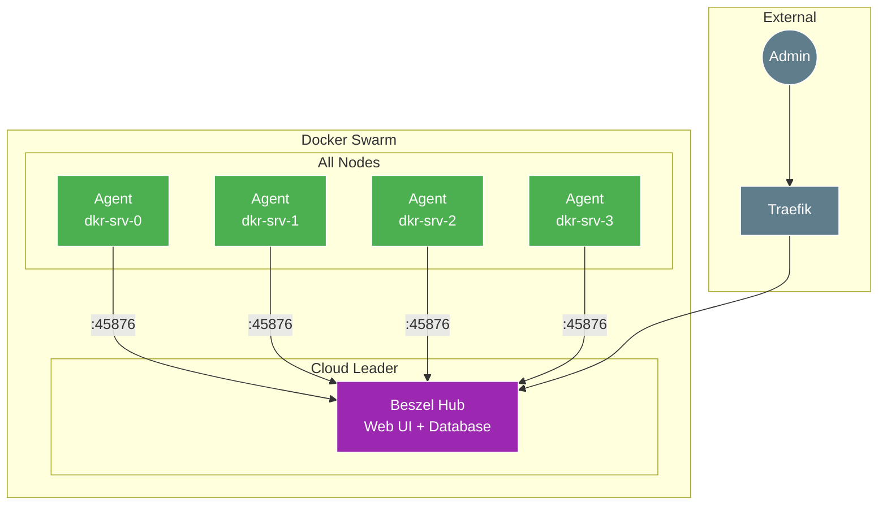

# Beszel Monitoring Setup

[Beszel](https://www.beszel.dev/) is a lightweight server monitoring platform with a Hub-Agent architecture. It provides real-time metrics, Docker container monitoring, and historical data without the complexity of heavier solutions like Prometheus/Grafana.

## Architecture



## Features

- **Lightweight** - Minimal resource usage
- **Docker Monitoring** - Container stats and logs
- **SSH Key Authentication** - Secure agent communication
- **Real-time Metrics** - CPU, memory, disk, network
- **Historical Data** - Built-in data retention
- **Alerts** - Configurable thresholds

## Prerequisites

- Docker Swarm cluster running
- `traefik` stack deployed
- `proxy` overlay network created
- Tailscale mesh for secure agent communication (recommended)

## Environment Variables

Managed via [Doppler](https://www.doppler.com/) and injected by Terraform:

| Variable | Description | Required |
|:---|:---|:---|
| `DOMAIN` | Base domain for Hub UI access | Yes |
| `BESZEL_AGENT_KEY` | Hub's public key for agent auth (`ssh-ed25519...`) | Yes (after Hub init) |
| `BESZEL_AGENT_TOKEN` | Agent token for push mode authentication | Yes (after Hub init) |

## Deployment Process

Beszel requires a two-phase deployment:

### Phase 1: Deploy Hub (Initial)

Deploy with empty agent credentials initially:

```bash
cd 20_app_deployment
task apply
```

### Phase 2: Initialize Hub & Get Credentials

1. Access the Beszel Hub at `https://beszel.<your-domain>`
2. Create your administrator account
3. Click **Add System**
4. Copy the **Agent Public Key** (starts with `ssh-ed25519...`)
5. Note the **Agent Token** if using push mode

### Phase 3: Store Credentials in Doppler

```bash
doppler secrets set BESZEL_AGENT_KEY "ssh-ed25519 AAAAC3..."
doppler secrets set BESZEL_AGENT_TOKEN "your-agent-token"
```

### Phase 4: Redeploy with Credentials

```bash
cd 20_app_deployment
task apply
```

The agents will now authenticate successfully with the Hub.

## Stack Components

### Hub Service

- Runs on cloud leader only (`node.labels.leader == true`)
- Exposes web UI via Traefik at `https://beszel.<domain>`
- Data stored in `beszel-data` Docker volume
- Listens on port 8090 internally

### Agent Service

- Runs on **all nodes** (global mode)
- Uses **host networking** for port 45876
- Docker socket mounted for container monitoring
- Resource limits: 128M memory max

## Adding Nodes to Hub

After agents are deployed, add each node in the Hub UI:

1. Go to Hub UI → **Add System**
2. For each node, enter:

| Field | Value |
|:---|:---|
| Name | `dkr-srv-0`, `dkr-srv-1`, etc. |
| Host | Node's Tailscale IP (recommended) or public IP |
| Port | `45876` |

### Using Tailscale IPs (Recommended)

For secure internal communication:

```bash
# Get Tailscale IPs
ssh fs@dkr-srv-0 'tailscale ip -4'
ssh fs@dkr-srv-1 'tailscale ip -4'
# etc.
```

## Verification

### Check Services

```bash
# Check Hub
docker service ps beszel_hub

# Check Agents
docker service ps beszel_agent
```

### Check Agent Logs

```bash
docker service logs beszel_agent -f
```

### Test Agent Connectivity

```bash
# From Hub node, test agent port
nc -zv <agent-tailscale-ip> 45876
```

## Troubleshooting

| Issue | Cause | Solution |
|:---|:---|:---|
| Agent shows "no key provided" | Missing `BESZEL_AGENT_KEY` | Set in Doppler, re-run `task apply` |
| Hub cannot reach agent | Wrong IP or firewall | Use Tailscale IP, check port 45876 |
| Metrics missing | Docker socket not mounted | Verify volume mount in service |
| Agent auth fails | Key mismatch | Get fresh key from Hub → Add System |

### Force Agent Restart

```bash
docker service update --force beszel_agent
```

## Data Persistence

| Volume | Purpose |
|:---|:---|
| `beszel-data` | Hub database and settings |

### Backup

```bash
# On cloud leader
docker run --rm \
  -v beszel_beszel-data:/data \
  -v $(pwd):/backup \
  alpine tar czf /backup/beszel-backup.tar.gz /data
```

## External Resources

- [Beszel Documentation](https://www.beszel.dev/)
- [Beszel GitHub](https://github.com/henrygd/beszel)
- [Beszel Docker Hub - Hub](https://hub.docker.com/r/henrygd/beszel)
- [Beszel Docker Hub - Agent](https://hub.docker.com/r/henrygd/beszel-agent)
