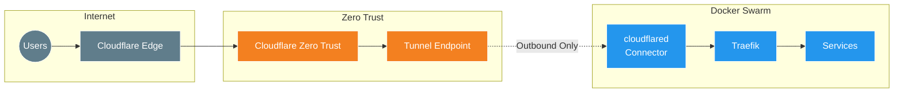

# Cloudflare Tunnel Setup

[Cloudflare Tunnel](https://developers.cloudflare.com/cloudflare-one/connections/connect-networks/) (formerly Argo Tunnel) provides secure, outbound-only connections from your infrastructure to Cloudflare's network. This eliminates the need to open inbound ports on your firewall.

## Architecture



## Benefits

- **No open inbound ports** - All connections are outbound
- **Built-in DDoS protection** via Cloudflare
- **Zero Trust security** - Can add authentication layers
- **Automatic failover** - Multiple connectors for redundancy
- **No public IP required** for on-premises services

## Prerequisites

- [Cloudflare](https://www.cloudflare.com/) account with domain
- Domain DNS managed by Cloudflare
- `traefik` stack deployed and running
- `proxy` overlay network created

## Environment Variables

| Variable | Description | Source |
|:---|:---|:---|
| `CLOUDFLARE_TUNNEL_TOKEN` | Tunnel authentication token | Auto-generated by Terraform |

The tunnel token is automatically:
1. Generated during `10_infra_deployment`
2. Stored in Doppler as `CLOUDFLARE_TUNNEL_TOKEN`
3. Injected into the stack by `20_app_deployment`

## Tunnel Creation

### Automatic (Recommended)

The tunnel is created automatically by Terraform in `10_infra_deployment/main_cf_tunnel.tf`:

```hcl
resource "cloudflare_zero_trust_tunnel_cloudflared" "main" {
  account_id    = var.CLOUDFLARE_ACCOUNT_ID
  name          = "domain_name"
  tunnel_secret = random_id.tunnel_secret.b64_std
}
```

### Manual (Alternative)

If you need to create the tunnel manually:

1. Go to [Cloudflare Zero Trust Dashboard](https://one.dash.cloudflare.com/)
2. Navigate to **Networks** → **Tunnels**
3. Click **Create a tunnel**
4. Select **Cloudflared** connector type
5. Name it (e.g., `docker-swarm-tunnel`)
6. Copy the tunnel token
7. Store in Doppler as `CLOUDFLARE_TUNNEL_TOKEN`

## Ingress Configuration

### Wildcard Routing (Recommended)

The tunnel is configured with wildcard ingress to route all subdomains to Traefik:

```hcl
ingress = [
  {
    hostname = "*.${domain}"
    service  = "https://traefik:443"
    origin_request = {
      no_tls_verify = true
    }
  },
  {
    service = "http_status:404"
  }
]
```

**Traffic Flow:**
1. User visits `https://myapp.yourdomain.com`
2. Cloudflare routes to tunnel
3. `cloudflared` forwards to `https://traefik:443`
4. Traefik routes to appropriate service

### Per-Service Routing (Alternative)

For specific hostname routing, configure in Zero Trust Dashboard:

| Subdomain | Domain | Service | URL |
|:---|:---|:---|:---|
| `traefik` | `yourdomain.com` | HTTPS | `traefik:443` |
| `whoami` | `yourdomain.com` | HTTPS | `traefik:443` |
| `beszel` | `yourdomain.com` | HTTPS | `traefik:443` |

## Deployment

### Via Terraform (Recommended)

```bash
cd 20_app_deployment
task apply
```

### Manual Deployment

```bash
# Set environment variable
export CLOUDFLARE_TUNNEL_TOKEN="eyJ..."

# Deploy stack
docker stack deploy -c cloudflared-stack.yml cloudflared
```

## Stack Configuration

```yaml
services:
  cloudflared:
    image: cloudflare/cloudflared:latest
    command: tunnel --no-autoupdate run
    environment:
      - TUNNEL_TOKEN=${CLOUDFLARE_TUNNEL_TOKEN}
    networks:
      - proxy
    deploy:
      mode: global  # Runs on all nodes
```

**Key Points:**
- `mode: global` - Runs on every Swarm node for redundancy
- Connected to `proxy` network for Traefik access
- `--no-autoupdate` - Prevents container restarts from updates

## Verification

### Check Tunnel Status

**Cloudflare Dashboard:**
1. Go to [Zero Trust Dashboard](https://one.dash.cloudflare.com/)
2. Navigate to **Networks** → **Tunnels**
3. Find your tunnel - status should be **Healthy**

**Docker:**
```bash
# Check service status
docker service ls | grep cloudflared

# Check logs
docker service logs cloudflared_cloudflared -f
```

### Test Connectivity

```bash
# From external network
curl -I https://traefik.yourdomain.com

# Should return 200 OK with Traefik headers
```

## Troubleshooting

### "Too Many Redirects"

**Cause:** Tunnel pointing to HTTP instead of HTTPS, or Traefik redirecting

**Solution:**
1. Ensure tunnel service URL is `https://traefik:443`
2. Enable **No TLS Verify** in origin settings
3. Verify Cloudflare SSL mode is **Full (Strict)**

### Tunnel Not Connecting

**Check 1:** Verify token is correct
```bash
docker service inspect cloudflared_cloudflared --format '{{json .Spec.TaskTemplate.ContainerSpec.Env}}'
```

**Check 2:** Check for network connectivity
```bash
docker service logs cloudflared_cloudflared 2>&1 | grep -i "error\|failed"
```

**Check 3:** Verify proxy network exists
```bash
docker network ls | grep proxy
```

### Service Not Accessible via Tunnel

**Check 1:** Verify DNS is pointing to tunnel
```bash
dig CNAME *.yourdomain.com
# Should return: <tunnel-id>.cfargotunnel.com
```

**Check 2:** Verify Traefik has the route
- Check Traefik dashboard
- Verify service labels

**Check 3:** Test internal routing
```bash
# SSH to a Swarm node
docker run --rm --network proxy curlimages/curl \
  curl -k https://traefik/
```

### Multiple Connector Instances

With `mode: global`, you'll see multiple cloudflared instances:

```bash
docker service ps cloudflared_cloudflared
# Shows one task per node
```

This is expected and provides redundancy.

## TLS Configuration

### No TLS Verify

Required because Traefik uses Let's Encrypt certificates that cloudflared doesn't trust by default:

```hcl
origin_request = {
  no_tls_verify = true
}
```

This is safe because:
- Traffic is encrypted end-to-end
- Cloudflare → cloudflared is through secure tunnel
- cloudflared → Traefik is internal Docker network

### Using Origin Certificates (Alternative)

For stricter security, use Cloudflare Origin Certificates:

1. Generate origin certificate in Cloudflare Dashboard
2. Configure Traefik to use these certificates
3. Remove `no_tls_verify`

## Security Considerations

- Tunnel token is sensitive - store securely in Doppler
- All traffic passes through Cloudflare (visibility concern)
- Consider Cloudflare Access policies for additional authentication
- The tunnel uses outbound connections only (no inbound firewall rules needed)

### Adding Cloudflare Access

To require authentication:

1. Go to [Zero Trust Dashboard](https://one.dash.cloudflare.com/)
2. Navigate to **Access** → **Applications**
3. Add application for your hostname
4. Configure authentication policy

## External Resources

- [Cloudflare Tunnel Documentation](https://developers.cloudflare.com/cloudflare-one/connections/connect-networks/)
- [Zero Trust Dashboard](https://one.dash.cloudflare.com/)
- [Cloudflared Docker Image](https://hub.docker.com/r/cloudflare/cloudflared)
- [Tunnel Ingress Rules](https://developers.cloudflare.com/cloudflare-one/connections/connect-networks/configure-tunnels/origin-configuration/)
