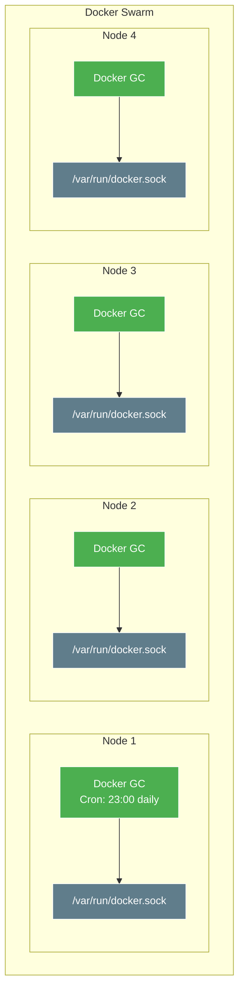

# Docker GC (Garbage Collection) Setup

Docker GC is a simple container that runs a daily cron job to clean up unused Docker images, containers, and volumes across all Swarm nodes.

## Overview



## Features

- **Global deployment** - Runs on every Swarm node
- **Scheduled cleanup** - Executes `docker system prune -af` at 23:00 daily
- **Low resource usage** - 64MB memory limit
- **Automatic restart** - Restarts on failure

## Environment Variables

| Variable | Description | Default |
|:---|:---|:---|
| `TZ` | Timezone for cron schedule | `Europe/London` |
| `PUID` | User ID for file ownership | `1000` |
| `PGID` | Group ID for file ownership | `1000` |

## What Gets Cleaned

The `docker system prune -af` command removes:

- All stopped containers
- All unused networks
- All dangling images
- All unused images (not just dangling)
- All build cache

> **Warning:** This is aggressive cleanup. Ensure important containers are running before the scheduled time.

## Deployment

Deployed automatically via Terraform/Portainer:

```bash
cd 20_app_deployment
task apply
```

## Verification

```bash
# Check service status across nodes
docker service ps docker-gc_docker-gc

# Check logs for cleanup activity
docker service logs docker-gc_docker-gc
```

## Customization

### Change Schedule

Modify the cron expression in `docker-gc-stack.yml`:

```yaml
command: >
  sh -c "echo '0 23 * * * docker system prune -af' > /etc/crontabs/root && crond -f -l 8"
```

Cron format: `minute hour day month weekday`

Examples:
- `0 23 * * *` - Daily at 23:00
- `0 */6 * * *` - Every 6 hours
- `0 3 * * 0` - Weekly on Sunday at 03:00

### Keep Recent Images

For less aggressive cleanup, modify the command:

```yaml
command: >
  sh -c "echo '0 23 * * * docker system prune -f --filter until=24h' > /etc/crontabs/root && crond -f -l 8"
```

## Troubleshooting

| Issue | Cause | Solution |
|:---|:---|:---|
| Cleanup not running | Wrong timezone | Verify `TZ` environment variable |
| Images still accumulating | Container not running | Check `docker service ps docker-gc_docker-gc` |
| Service keeps restarting | Docker socket access denied | Verify socket mount in stack |
