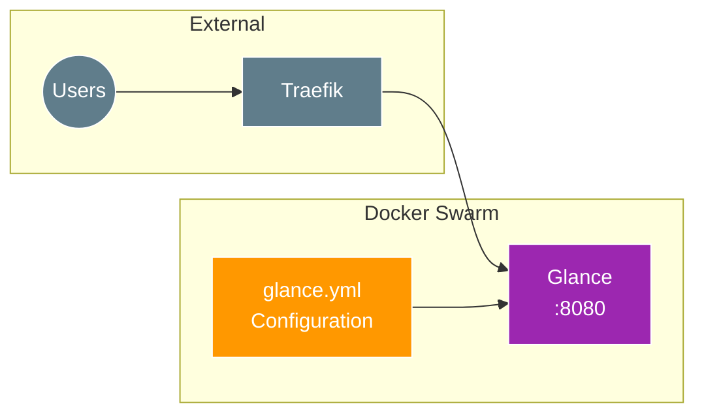

# Glance Dashboard Setup

[Glance](https://github.com/glanceapp/glance) is a self-hosted dashboard that puts all your feeds in one place. It's fast, lightweight, and highly customizable.

## Overview



## Features

- **RSS/Atom feeds** - Aggregate news and blog posts
- **Weather** - Current conditions and forecasts
- **Stocks** - Market data and watchlists
- **Bookmarks** - Quick access links
- **Calendar** - iCal integration
- **Docker stats** - Container monitoring (via socket access)
- **Customizable themes** - Light/dark mode, accent colors

## Environment Variables

| Variable | Description | Default |
|:---|:---|:---|
| `DOMAIN` | Base domain for access URL | Required |
| `TZ` | Timezone for date/time display | `Europe/London` |
| `PUID` | User ID for file ownership | `1000` |
| `PGID` | Group ID for file ownership | `1000` |

## Configuration

Glance is configured via `glance.yml` which is deployed as a Docker config:

```yaml
configs:
  glance_config:
    file: ./glance.yml
```

### Sample Configuration Structure

```yaml
# glance.yml
server:
  port: 8080
  host: 0.0.0.0

theme:
  background-color: 240 21 15
  primary-color: 217 92 83
  positive-color: 115 54 76
  negative-color: 347 70 65

pages:
  - name: Home
    columns:
      - size: small
        widgets:
          - type: calendar
          - type: weather
            location: London, UK

      - size: full
        widgets:
          - type: rss
            title: Tech News
            feeds:
              - url: https://hnrss.org/frontpage
              - url: https://feeds.arstechnica.com/arstechnica/technology-lab
```

## Placement

Runs on the cloud leader node:

```yaml
placement:
  constraints:
    - node.role == manager
    - node.labels.cloud == true
```

## Storage

| Volume | Purpose |
|:---|:---|
| `glance-data` | Persistent data (cache, settings) |

## Deployment

```bash
cd 20_app_deployment
task apply
```

## Access

- **URL:** `https://glance.<your-domain>`

## Customization

### Adding Widgets

Edit `docker/glance/glance.yml` and redeploy:

```yaml
widgets:
  - type: bookmarks
    groups:
      - title: Services
        links:
          - title: Portainer
            url: https://portainer.example.com
          - title: Traefik
            url: https://traefik.example.com
```

### Changing Theme

```yaml
theme:
  background-color: 0 0 10  # HSL values
  primary-color: 200 80 50
  contrast-multiplier: 1.2
  text-saturation-multiplier: 0.5
```

## Troubleshooting

| Issue | Cause | Solution |
|:---|:---|:---|
| Dashboard not loading | Config syntax error | Validate YAML syntax in glance.yml |
| Widgets empty | Feed/API errors | Check container logs for fetch errors |
| Theme not applied | Config not mounted | Verify config mount in stack |

### View Logs

```bash
docker service logs glance_glance -f
```

## External Resources

- [Glance GitHub](https://github.com/glanceapp/glance)
- [Glance Documentation](https://github.com/glanceapp/glance/blob/main/docs/configuration.md)
- [Widget Reference](https://github.com/glanceapp/glance/blob/main/docs/widgets.md)
