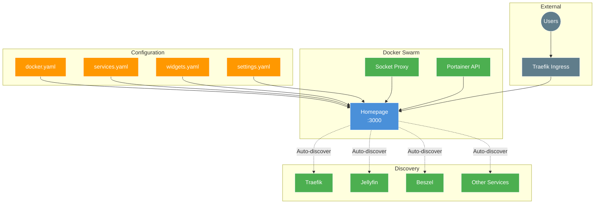

# Homepage Dashboard Setup

[Homepage](https://gethomepage.dev/) is a highly customizable application dashboard with integrations for over 100 services, Docker integration, and a beautiful, responsive design.

## Overview



## Features

- **Docker Integration** - Auto-discovers containers with labels
- **Service Widgets** - Real-time stats for 100+ services
- **Bookmarks** - Quick access links organized by groups
- **Information Widgets** - Weather, calendar, search, and more
- **Responsive Design** - Works on desktop, tablet, and mobile
- **Portainer Integration** - Displays stack and container status

## Environment Variables

| Variable | Description | Required |
|:---|:---|:---|
| `DOMAIN` | Base domain for access URL | Yes |
| `TZ` | Timezone for date/time display | Yes |
| `PUID` | User ID for file ownership | Yes |
| `PGID` | Group ID for file ownership | Yes |
| `PORTAINER_ACCESS_TOKEN` | Portainer API token for widget | Yes |
| `HOMEPAGE_ALLOWED_HOSTS` | Allowed hosts for CORS | Auto-configured |

## Configuration Files

Configuration is deployed via Docker configs from the `config/` directory:

```
docker/homepage/
├── homepage-stack.yml
├── setup.md
└── config/
    ├── docker.yaml      # Docker connection settings
    ├── services.yaml    # Manual service definitions
    ├── widgets.yaml     # Information widgets
    └── settings.yaml    # General settings
```

### docker.yaml

Configures Docker/Portainer connection for container discovery:

```yaml
# Docker socket proxy connection
docker:
  socket_proxy:
    host: socket-proxy_socket-proxy
    port: 2375

# Or Portainer API connection
portainer:
  url: https://portainer:9443
  token: {{HOMEPAGE_VAR_PORTAINER_ACCESS_TOKEN}}
```

### services.yaml

Define services manually or supplement auto-discovered ones:

```yaml
---
- Management:
    - Traefik:
        icon: traefik.png
        href: https://traefik.{{HOMEPAGE_VAR_DOMAIN}}
        description: Reverse Proxy
        widget:
          type: traefik
          url: http://traefik:8080

- Media:
    - Jellyfin:
        icon: jellyfin.png
        href: https://jellyfin.{{HOMEPAGE_VAR_DOMAIN}}
        widget:
          type: jellyfin
          url: http://jellyfin:8096
          key: {{HOMEPAGE_VAR_JELLYFIN_API_KEY}}
```

### widgets.yaml

Information widgets displayed at the top:

```yaml
---
- greeting:
    text_size: xl
    text: Welcome!

- datetime:
    text_size: xl
    format:
      dateStyle: long
      timeStyle: short

- search:
    provider: duckduckgo
    target: _blank
```

### settings.yaml

General dashboard settings:

```yaml
---
title: Homelab Dashboard

background:
  image: https://example.com/background.jpg
  blur: sm
  opacity: 50

cardBlur: md
theme: dark
color: slate

layout:
  Management:
    style: row
    columns: 4
  Media:
    style: row
    columns: 3
```

## Docker Label Auto-Discovery

Services can be auto-discovered by adding labels to their deployments:

```yaml
deploy:
  labels:
    - "homepage.group=Media"
    - "homepage.name=Jellyfin"
    - "homepage.icon=jellyfin.png"
    - "homepage.href=https://jellyfin.${DOMAIN}"
    - "homepage.description=Media Server"
    - "homepage.widget.type=jellyfin"
    - "homepage.widget.url=http://jellyfin:8096"
    - "homepage.widget.key=${JELLYFIN_API_KEY}"
```

### Available Label Options

| Label | Description |
|:---|:---|
| `homepage.group` | Group name for organization |
| `homepage.name` | Display name |
| `homepage.icon` | Icon name or URL |
| `homepage.href` | Link to service |
| `homepage.description` | Short description |
| `homepage.weight` | Sort order (lower = first) |
| `homepage.widget.type` | Widget type for stats |
| `homepage.widget.url` | Internal URL for widget |
| `homepage.widget.key` | API key for widget |

## Network Configuration

Homepage connects to multiple networks:

| Network | Purpose |
|:---|:---|
| `proxy` | Traefik ingress |
| `portainer_agent_network` | Portainer API access |
| `socket_proxy` | Docker API access via socket proxy |

## Placement

Runs on the cloud leader node:

```yaml
placement:
  constraints:
    - node.role == manager
    - node.labels.cloud == true
    - node.labels.leader == true
```

## Deployment

```bash
cd 20_app_deployment
task apply
```

## Access

- **URL:** `https://home.<your-domain>`

## Customizing Icons

Homepage supports multiple icon sources:

1. **Dashboard Icons** - Built-in: `jellyfin.png`, `traefik.png`
2. **Simple Icons** - Prefix with `si-`: `si-github`
3. **Material Design Icons** - Prefix with `mdi-`: `mdi-home`
4. **Selfh.st Icons** - Prefix with `sh-`: `sh-filebrowser-quantum.png`
5. **URL** - Direct URL to image

## Troubleshooting

| Issue | Cause | Solution |
|:---|:---|:---|
| Containers not discovered | Socket proxy not accessible | Check `socket_proxy` network connection |
| Widgets showing errors | Wrong API key/URL | Verify widget configuration |
| CORS errors | Host not allowed | Add to `HOMEPAGE_ALLOWED_HOSTS` |
| Config not updating | Config not redeployed | Redeploy stack via Portainer |

### View Logs

```bash
docker service logs homepage_homepage -f
```

### Force Config Reload

Redeploy the stack to update configs:

```bash
cd 20_app_deployment
terraform taint 'portainer_stack.homepage'
task apply
```

## External Resources

- [Homepage Documentation](https://gethomepage.dev/)
- [Homepage GitHub](https://github.com/gethomepage/homepage)
- [Widget Reference](https://gethomepage.dev/widgets/)
- [Service Widgets](https://gethomepage.dev/widgets/services/)
- [Icons Reference](https://gethomepage.dev/configs/services/#icons)
