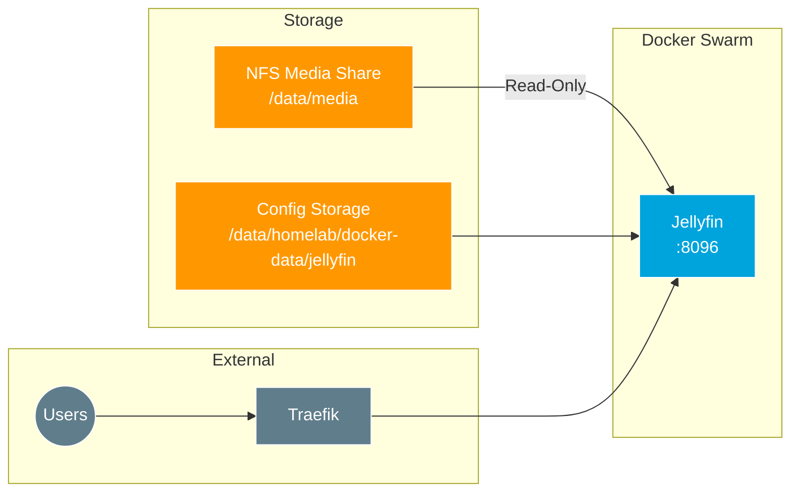

# Jellyfin Media Server Setup

[Jellyfin](https://jellyfin.org/) is a free, open-source media server that puts you in control of your media. Stream movies, TV shows, music, and more from your own server.

## Overview



## Features

- **No subscription required** - Completely free and open source
- **Multi-platform clients** - Apps for web, mobile, TV, and more
- **Live TV & DVR** - With compatible tuner hardware
- **Transcoding** - Hardware-accelerated when available
- **User management** - Multiple users with parental controls
- **Plugins** - Extend functionality with community plugins

## Environment Variables

| Variable | Description | Required |
|:---|:---|:---|
| `DOMAIN` | Base domain for access URL | Yes |
| `TZ` | Timezone | Yes |
| `PUID` | User ID for file ownership | Yes |
| `PGID` | Group ID for file ownership | Yes |
| `JELLYFIN_API_KEY` | API key for Homepage widget integration | After setup |

## Storage Configuration

### Directory Structure

```
/data/
├── homelab/
│   └── docker-data/
│       ├── jellyfin/           # Jellyfin configuration
│       │   ├── config/
│       │   ├── data/
│       │   ├── log/
│       │   └── metadata/
│       └── jellyfin-cache/     # Transcoding cache
│
└── media/                      # NFS mount (read-only to Jellyfin)
    ├── Movies/
    ├── TV Shows/
    ├── Music/
    └── Photos/
```

### Required Directories

Ensure these directories exist on Proxmox nodes:

```bash
mkdir -p /data/homelab/docker-data/jellyfin
mkdir -p /data/homelab/docker-data/jellyfin-cache
```

### NFS Media Mount

The media library is mounted read-only from the NFS share:

```yaml
volumes:
  - type: bind
    source: /data/media
    target: /media
    read_only: true
```

## Placement Constraints

Runs only on Proxmox nodes (which have NFS access):

```yaml
placement:
  constraints:
    - node.labels.proxmox == true
```

## Resource Limits

Resource constraints prevent Jellyfin from consuming excessive resources:

```yaml
resources:
  limits:
    cpus: '5.60'    # 70% of 8 cores
    memory: 7G      # 7 GB RAM cap
```

## Deployment

```bash
cd 20_app_deployment
task apply
```

## Initial Setup

1. Access Jellyfin at `https://jellyfin.<your-domain>`
2. Complete the setup wizard:
   - Create admin account
   - Add media libraries pointing to `/media/Movies`, `/media/TV Shows`, etc.
   - Configure metadata providers
3. Generate API key for Homepage:
   - Go to **Dashboard** → **API Keys**
   - Create new key
   - Save to Doppler as `JELLYFIN_API_KEY`

## Access

- **URL:** `https://jellyfin.<your-domain>`
- **Direct port:** `http://<node-ip>:8096` (ingress mode)

## Homepage Integration

Jellyfin is configured with Homepage labels for dashboard integration:

```yaml
labels:
  - "homepage.group=Docker Apps"
  - "homepage.name=Jellyfin"
  - "homepage.icon=jellyfin.png"
  - "homepage.href=https://jellyfin.${DOMAIN}"
  - "homepage.widget.type=jellyfin"
  - "homepage.widget.url=http://jellyfin:8096"
  - "homepage.widget.key=${JELLYFIN_API_KEY}"
```

## Hardware Transcoding

Currently not configured. To enable hardware transcoding on Proxmox:

1. Pass through GPU/iGPU to VM
2. Install required drivers in container
3. Add device mount to stack:

```yaml
devices:
  - /dev/dri:/dev/dri
```

## Troubleshooting

| Issue | Cause | Solution |
|:---|:---|:---|
| Media not visible | NFS mount failed | Check `/data/media` is mounted on host |
| Playback errors | Transcoding issues | Check cache directory permissions |
| Container won't start | Port conflict | Verify port 8096 is available |
| Slow library scan | NFS performance | Check network connectivity to NFS server |

### View Logs

```bash
docker service logs jellyfin_jellyfin -f
```

### Check NFS Mount

```bash
# SSH to Proxmox node
ssh fs@dkr-srv-1
mount | grep media
ls -la /data/media
```

## Backup

Important data to backup:

| Path | Content |
|:---|:---|
| `/data/homelab/docker-data/jellyfin/` | Configuration, users, metadata |

```bash
# On Proxmox node
tar czf jellyfin-backup.tar.gz /data/homelab/docker-data/jellyfin/
```

## External Resources

- [Jellyfin Documentation](https://jellyfin.org/docs/)
- [Jellyfin GitHub](https://github.com/jellyfin/jellyfin)
- [Hardware Transcoding](https://jellyfin.org/docs/general/administration/hardware-acceleration/)
- [Jellyfin Clients](https://jellyfin.org/downloads/clients/)
