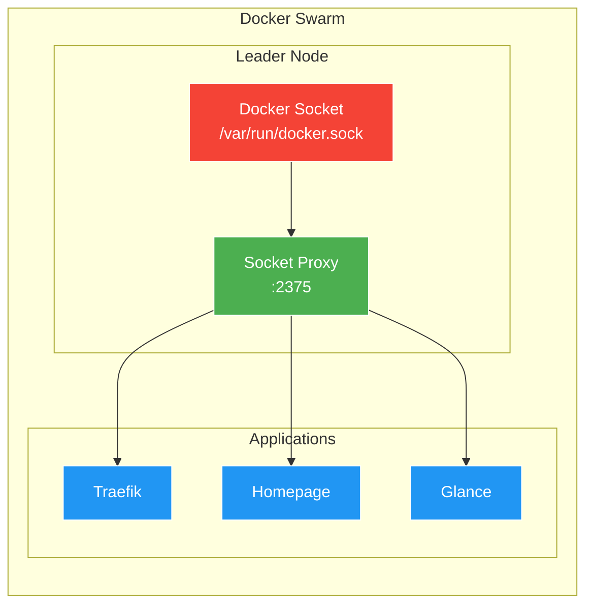

# Docker Socket Proxy Setup

[Docker Socket Proxy](https://github.com/Tecnativa/docker-socket-proxy) provides secure, read-only (or controlled) access to the Docker API. This prevents containers from having full root access to the host via the Docker socket.

## Overview



## Why Use Socket Proxy?

Mounting `/var/run/docker.sock` directly gives containers **root-level access** to the host. The socket proxy:

- **Limits access** - Only exposes specific Docker API endpoints
- **Read-only by default** - Prevents container manipulation
- **Auditable** - Can log all API calls
- **Network isolated** - Runs on dedicated overlay network

## Environment Variables

| Variable | Description | Value |
|:---|:---|:---|
| `CONTAINERS` | List containers | `1` (enabled) |
| `SERVICES` | List services | `1` (enabled) |
| `TASKS` | List tasks | `1` (enabled) |
| `POST` | Allow POST requests | `1` (enabled) |
| `EVENTS` | Stream events | `1` (enabled) |
| `INFO` | System info | `1` (enabled) |
| `IMAGES` | List images | `1` (enabled) |
| `NETWORKS` | List networks | `1` (enabled) |
| `VOLUMES` | List volumes | `1` (enabled) |
| `PING` | Health check | `1` (enabled) |
| `VERSION` | API version | `1` (enabled) |
| `NODES` | List nodes | `1` (enabled) |
| `ALLOW_START` | Start containers | `1` (enabled) |
| `ALLOW_STOP` | Stop containers | `1` (enabled) |
| `ALLOW_RESTARTS` | Restart containers | `1` (enabled) |

## Network Configuration

The socket proxy runs on a dedicated overlay network:

| Network | Subnet | Purpose |
|:---|:---|:---|
| `socket_proxy` | `10.0.200.0/24` | Docker API access for trusted containers |

## Consuming Applications

Applications connect to the socket proxy instead of mounting the Docker socket directly:

### Traefik

```yaml
command:
  - "--providers.swarm.endpoint=tcp://socket-proxy_socket-proxy:2375"
networks:
  - socket_proxy
```

### Homepage

```yaml
networks:
  - socket_proxy
# Uses Docker discovery via socket proxy
```

## Deployment

Deployed automatically before Traefik:

```bash
cd 20_app_deployment
task apply
```

## Placement

Runs only on the cloud leader node:

```yaml
placement:
  constraints:
    - node.role == manager
    - node.labels.cloud == true
    - node.labels.leader == true
```

## Security Considerations

### Current Configuration

The current configuration enables `POST`, `ALLOW_START`, `ALLOW_STOP`, and `ALLOW_RESTARTS` for:
- Traefik log rotation (needs to signal Traefik to reopen logs)
- Homepage container control features

### Read-Only Configuration

For stricter security, disable write operations:

```yaml
environment:
  - POST=0
  - ALLOW_START=0
  - ALLOW_STOP=0
  - ALLOW_RESTARTS=0
```

## Verification

```bash
# Check service status
docker service ps socket-proxy_socket-proxy

# Test API access from within the network
docker run --rm --network socket_proxy curlimages/curl \
  curl -s http://socket-proxy_socket-proxy:2375/version
```

## Troubleshooting

| Issue | Cause | Solution |
|:---|:---|:---|
| Traefik can't discover services | Socket proxy not running | Check `docker service ps socket-proxy_socket-proxy` |
| API calls rejected | Endpoint not enabled | Enable required endpoint in environment |
| Connection refused | Wrong network | Ensure container is on `socket_proxy` network |

## External Resources

- [Docker Socket Proxy GitHub](https://github.com/Tecnativa/docker-socket-proxy)
- [Docker API Reference](https://docs.docker.com/engine/api/)
