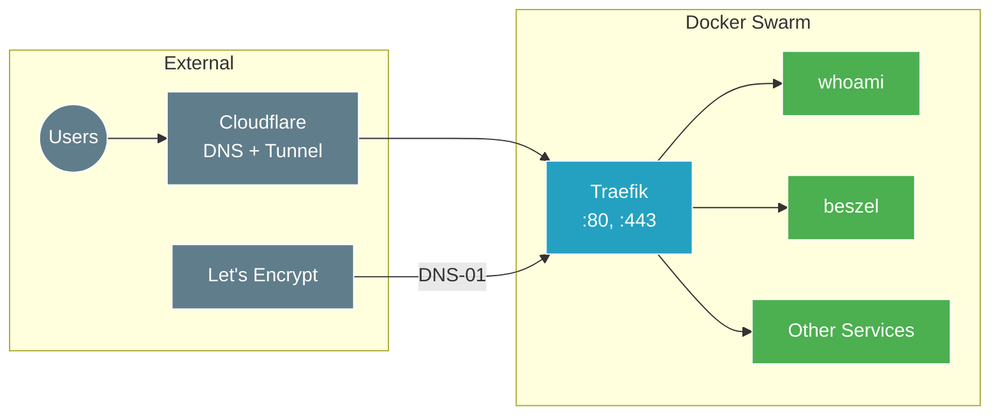

# Traefik Ingress Controller Setup

[Traefik](https://traefik.io/traefik/) is a modern HTTP reverse proxy and load balancer that makes deploying microservices easy. This stack deploys Traefik as the ingress controller for the Docker Swarm cluster with automatic SSL certificate management via Let's Encrypt.

## Architecture



## Prerequisites

- Docker Swarm initialized with manager nodes
- [Cloudflare](https://www.cloudflare.com/) account with domain
- Cloudflare API Token with permissions:
  - `Zone:DNS:Edit`
  - `Zone:Zone:Read`
- `proxy` overlay network created (via Terraform)
- Node labels configured:
  - `cloud=true` on cloud leader
  - `leader=true` on cloud leader

## Environment Variables

Managed via [Doppler](https://www.doppler.com/) and injected by Terraform:

| Variable | Description | Example |
|:---|:---|:---|
| `CLOUDFLARE_API_TOKEN` | Cloudflare API token for DNS-01 challenge | `abc123xyz...` |
| `ACME_EMAIL` | Email for Let's Encrypt registration | `admin@example.com` |
| `DOMAIN` | Base domain for routing rules | `example.com` |

### Creating a Cloudflare API Token

1. Go to [Cloudflare Dashboard](https://dash.cloudflare.com/) → **My Profile** → **API Tokens**
2. Click **Create Token**
3. Use **Edit zone DNS** template
4. Configure permissions:
   - **Zone - DNS - Edit**
   - **Zone - Zone - Read**
5. Set zone resources to your domain
6. Create and copy the token

## DNS Configuration

### Option A: Direct Access (No Tunnel)

If exposing Traefik directly to the internet:

1. Find the public IP of `dkr-srv-0` (cloud leader)
2. Create DNS records in Cloudflare:

| Type | Name | Content | Proxied |
|:---|:---|:---|:---|
| A | `traefik` | `<Public IP>` | Yes |
| A | `whoami` | `<Public IP>` | Yes |
| A | `*` | `<Public IP>` | Yes (optional wildcard) |

### Option B: Via Cloudflare Tunnel (Recommended)

When using the `cloudflared` stack:

- DNS is automatically configured by Terraform
- Wildcard CNAME points to the tunnel
- No need to expose ports publicly

## Stack Files

### traefik-stack.yml

Main Traefik deployment with:
- Swarm mode provider
- HTTP → HTTPS redirect
- Let's Encrypt DNS-01 via Cloudflare
- Dashboard enabled

### whoami-stack.yml

Test service for verifying:
- Routing configuration
- Load balancing across replicas
- SSL certificate generation

## Deployment

Deployment is handled by Terraform in `20_app_deployment/`:

```bash
cd 20_app_deployment
task apply
```

### Manual Deployment (Development)

```bash
# Set environment variables
export CLOUDFLARE_API_TOKEN="your-token"
export ACME_EMAIL="admin@example.com"
export DOMAIN="example.com"

# Deploy stack
docker stack deploy -c traefik-stack.yml traefik
docker stack deploy -c whoami-stack.yml whoami
```

## Verification

### Dashboard Access

Navigate to `https://traefik.<your-domain>`:
- View all routes and services
- Monitor active connections
- Check certificate status

### Load Balancing Test

Visit `https://whoami.<your-domain>` and refresh multiple times:
- **Hostname** and **IP** should change
- Confirms traffic is distributed across replicas

### Check Services

```bash
# SSH to Swarm leader
ssh fs@dkr-srv-0

# List Traefik services
docker stack services traefik

# Check Traefik logs
docker service logs traefik_traefik -f

# List whoami services
docker stack services whoami
```

## Traefik Configuration

### Entrypoints

| Entrypoint | Port | Purpose |
|:---|:---|:---|
| `web` | 80 | HTTP (redirects to HTTPS) |
| `websecure` | 443 | HTTPS |

### Certificate Resolver

```yaml
# Let's Encrypt with Cloudflare DNS-01
--certificatesresolvers.cloudflare.acme.email=${ACME_EMAIL}
--certificatesresolvers.cloudflare.acme.storage=/acme/acme.json
--certificatesresolvers.cloudflare.acme.dnschallenge=true
--certificatesresolvers.cloudflare.acme.dnschallenge.provider=cloudflare
```

### Placement Constraints

Traefik runs on the cloud leader node:

```yaml
constraints:
  - node.role == manager
  - node.labels.cloud == true
  - node.labels.leader == true
```

## Adding Services to Traefik

To expose a new service through Traefik, add these labels:

```yaml
services:
  myservice:
    deploy:
      labels:
        - "traefik.enable=true"
        - "traefik.http.routers.myservice.rule=Host(`myservice.${DOMAIN}`)"
        - "traefik.http.routers.myservice.entrypoints=websecure"
        - "traefik.http.routers.myservice.tls.certresolver=cloudflare"
        - "traefik.http.services.myservice.loadbalancer.server.port=8080"
    networks:
      - proxy

networks:
  proxy:
    external: true
```

## Troubleshooting

### "Too Many Redirects" Error

**Cause:** Cloudflare SSL/TLS mode set to **Flexible**

**Solution:**
1. Go to [Cloudflare Dashboard](https://dash.cloudflare.com/)
2. Select your domain → **SSL/TLS** → **Overview**
3. Change encryption mode to **Full (Strict)**

This ensures Cloudflare connects to Traefik via HTTPS.

### Certificate Not Generating

**Check 1:** Verify Cloudflare API token
```bash
docker service logs traefik_traefik 2>&1 | grep -i "acme\|certificate"
```

**Check 2:** Verify DNS propagation
```bash
dig +short traefik.yourdomain.com
```

**Check 3:** Check ACME storage
```bash
docker exec $(docker ps -q -f name=traefik) cat /acme/acme.json
```

### Service Not Accessible

**Check 1:** Verify service is on proxy network
```bash
docker service inspect myservice --format '{{.Spec.TaskTemplate.Networks}}'
```

**Check 2:** Verify labels
```bash
docker service inspect myservice --format '{{json .Spec.Labels}}' | jq
```

**Check 3:** Check Traefik dashboard for the route

### Dashboard Not Accessible

**Check 1:** Verify DNS resolution
```bash
nslookup traefik.yourdomain.com
```

**Check 2:** Check Traefik is running
```bash
docker service ps traefik_traefik
```

## Volumes

| Volume | Path | Purpose |
|:---|:---|:---|
| `traefik-acme` | `/acme` | Let's Encrypt certificates |

## Network

| Network | Type | Purpose |
|:---|:---|:---|
| `proxy` | Overlay (Swarm) | Inter-service communication |

## Security Considerations

- Dashboard is exposed publicly (consider adding authentication)
- API token is passed via environment variable
- ACME certificates stored in Docker volume
- Docker socket is mounted read-only

### Adding Dashboard Authentication

To add basic auth to the dashboard, add these labels:

```yaml
labels:
  - "traefik.http.middlewares.auth.basicauth.users=admin:$$apr1$$..."
  - "traefik.http.routers.traefik.middlewares=auth"
```

Generate password hash:
```bash
htpasswd -nb admin yourpassword
```

## External Resources

- [Traefik Documentation](https://doc.traefik.io/traefik/)
- [Traefik Docker Swarm Guide](https://doc.traefik.io/traefik/providers/swarm/)
- [Let's Encrypt Rate Limits](https://letsencrypt.org/docs/rate-limits/)
- [Cloudflare API Tokens](https://developers.cloudflare.com/fundamentals/api/get-started/create-token/)
